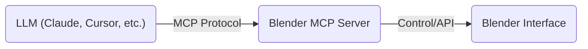

# FabStack - AI powered workflows for digital fabrication

All this started with a simple question during Fab25 Conference in Brno: Can I control Mods using MCP?

## Components

### What is Mods?

Mods is a graphical interface to control most machines on Fablabs, enabling you to create workflows assembling different nodes that will load and manipulate input files and connect to digital fabrication machines to produce them.

[https://gitlab.fabcloud.org/pub/project/mods]

### What is MCP?

Model Context Protocol is a new open source protocol proposed by Anthorpic to allow LLM to connect to third party sources in a standardized way. This is the general overview of the components of a MCP setup:

![/images/mcp-architecture.png]

## Inspiring vision

Mods can connect to any machine in the lab. MCP can connect to "almost" any software. Can LLMs make almost anything? (Short answer: not at this particular moment in time.)

During last months several pieces have been launched to make this idea possible.

- Design: Blender MCP server enables LLMs to control the Blender interface, so you can describe what you are looking for and have the LLM produce it by controling the Blender interface.

[https://blender-mcp.com]

- Accessing filesystem: You can have LLMs access to your filesystem, so you can read and can write into the filesystem. This is based on a core module offered in the main MCP repo.

[https://github.com/modelcontextprotocol/servers/tree/main/src/filesystem]

- Sending the design to the machine: Mods can be used to load any file from the filesystem and send it to a machine. This is all based on a web interface that handles modules and connections. The connection to the machine is performed via WebUSB and WebSerial working over Chrome browser.

- Controlling the browser: Microsoft has released Playwright MCP server that enables LLM to control the browser. Any browser, like... Chrome.

[https://github.com/microsoft/playwright-mcp]

```mermaid
flowchart TD
    LLM("LLM (Claude, GPT, etc.)")
    BlenderMCP("Blender MCP Server")
    FilesystemMCP("Filesystem MCP Server")
    PlaywrightMCP("Playwright MCP Server")
    Mods("Mods (Web Interface)")
    Chrome("Chrome Browser (WebUSB/WebSerial)")
    Machine("Digital Fabrication Machine")

    LLM -- "MCP Protocol" --> BlenderMCP
    LLM -- "MCP Protocol" --> FilesystemMCP
    LLM -- "MCP Protocol" --> PlaywrightMCP

    FilesystemMCP -- "Files"
    PlaywrightMCP -- "Control" --> Mods
    Mods -- "Send to Machine" --> Chrome
    Chrome -- "WebUSB/WebSerial" --> Machine
```

### How should it work

1. You open you MCP Host (Claude, Cursor) and describe a design you want to make. The LLM chooses the blender-mcp tool and produces it. Then saves that to the local filesystem using either blender-mcp and/or mcp-filesystem. (Proposed prompt: Use blender to create a flat heart shaped design and export it as STL / SVG)

2. You ask then the LLM to send the design to a laser cutter / 3D printing MCP tools

3. The LLM controls the tool and it works (or it should work)!

## Challenges found

MCP Playwright can open the mods web interface, but it a blank page. It can click on websites but not right-click into sites, so it can't add any modules. If you right click on the interface, it can add the nodes. Providing it the mods.js adds enough information so it can learn what is available in the Mods tool.

MCP Blender is a bit complex to install (uvx + local add-on):

Notes on how toget the addon working: 

Installing the Blender Addon
- Download the addon.py file from this repo
- Open Blender
- Go to Edit > Preferences > Add-ons
- Click "Install..." and select the addon.py file
- Enable the addon by checking the box next to "Interface: Blender MCP"

Then you have to enable it on the sidebar of the viewport, clicking BlenderMCP and activating the checkbox.



## Cool things to keep in check

3D Printers: There is an existing MCP tool for managing most 3D Printers: https://dmontgomery40.github.io/Portfolio/Projects/mcp-3D-printer-server.html

To use this plugin you need the contact details for your printer API and also setup the route to your slicer executable. The route to configure the Slicer on Mac "/Applications/Original\ Prusa\ Drivers/PrusaSlicer.app/Contents/MacOS/PrusaSlicer"

Sample config.yaml is available with sample printers and slicer.

Laser / CNC machines: There is not such an existing MCP server but... There is mcp2serial server to connect to devices using serial connections: https://github.com/mcp2everything/mcp2serial

Sample config.json was developed, that should be compatible with MacOS.

Unfortunately, to test this we need to get a USB to Serial adapter to connect to the machines. Without it, you can't get a working config.yaml and the MCP server appears as disconnected.

## Tests so far

In this conversation, I used mcp-blender connection to create a heart shaped figure and export it as STL:

https://claude.ai/share/65307474-ee84-40d8-805b-0c1895eb9557

Output file was saved into the temp directory. I does indeed look like a heart:

![./images/blender-heart]

Both mcp2serial and mcp-3d-printer-server require external machines to work.

### Testing Mods

Claude using playwright gets very confused about the UI of mods, as there is a white canvas and no clear way to operate the tool. To access modules or get anything done, you need to right click and playwright doesn't know how to do that, so you need to right click for the agent to start working with the visual interface.

Alternative: asked Claude to work on mods.js and setup it up as a mcp server. It proposed some code that could be deployed to interact directly with mods using Javascript/Typescript. Full conversation here: 

https://claude.ai/share/24baaf3f-7074-4428-b6f3-3fcd61a96c4b

Next step would be packaging it as DXT and try to run it non-programmatically.